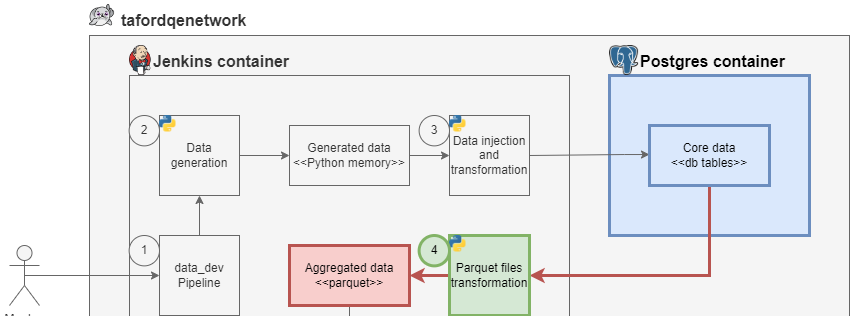
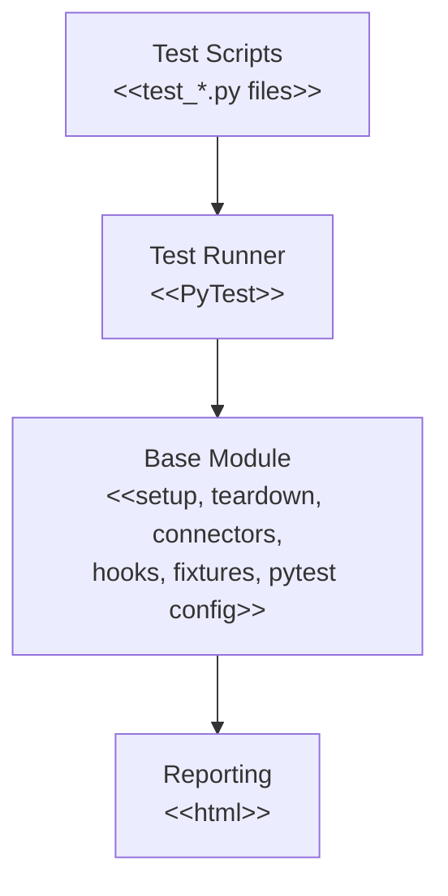
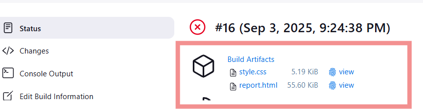

# PyTest DQ Framework Design

This file is the **framework design** (architecture, folders, fixtures, usage). Scope, mapping-based expected results, AI-assisted delivery, and the test-generation skill contract live in [test-automation-strategy.md](test-automation-strategy.md). Implement connectors and the DQ library from this design; generate dataset tests only via the project skill defined in the TAS.

# 1. Introduction

## 1.1 Overview

The PyTest DQ Framework is a robust, scalable, and modular test automation framework built using Python and PyTest. It is specifically designed to simplify the automation of data validation processes, enabling teams to write efficient, reusable, and maintainable data quality checks. The framework supports multiple types of testing, including functional, integration, and regression testing, and is fully compatible with PostgreSQL databases and parquet file reading.

By leveraging PyTest's powerful features and Python's flexibility, this framework empowers teams to perform comprehensive testing of data transformations and validations with minimal overhead.

## 1.2 Purpose

The primary purpose of the PyTest DQ Framework is to streamline the testing process by automating repetitive tasks, reducing manual effort, and improving the reliability of software releases. This framework enables Data Quality Engineers and other stakeholders to automate their checks, store them in a centralized and reusable repository, and achieve consistent test coverage across projects.

By adopting this framework, teams can:

- Ensure early detection of defects during development.
- Accelerate delivery timelines by reducing manual testing bottlenecks.
- Enhance collaboration between development and QA teams.

## 1.3 Objectives

The PyTest DQ Framework is designed to achieve the following key objectives:

- **Automate Testing of Data Transformations:** Streamline the validation of parquet file transformations and ensure data integrity.
- **Modular and Extensible Architecture:** Provide a flexible structure that allows easy extension and customization of test cases.
- **Detailed Reporting:** Generate comprehensive test reports to facilitate better analysis and debugging.
- **CI/CD Integration:** Enable seamless integration into CI/CD pipelines to ensure automated testing is part of the software delivery lifecycle.

The diagram below illustrates the **tafordqenetwork** data pipeline that the framework is designed to validate:



**Pipeline overview:**

1. **Step 1 — data_dev Pipeline:** A user triggers the `data_dev` pipeline in the Jenkins container.
2. **Step 2 — Data generation:** A Python process generates data stored in Python memory.
3. **Step 3 — Data injection and transformation:** A Python process injects and transforms data into PostgreSQL core tables.
4. **Step 4 — Parquet files transformation:** A Python process reads data from PostgreSQL and transforms it into aggregated Parquet files.

## 1.4 Why the Framework is Needed

In modern software development, manual testing alone is insufficient to meet the demands of iterative releases, complex applications, and large-scale data processing. Automated testing plays a crucial role in ensuring quality, reliability, and efficiency while reducing the time and effort required for validation.

The PyTest DQ Framework addresses the following challenges:

- **Speed and Scalability:** Manual testing is time-consuming and error-prone, especially for large datasets and frequent releases. Automation ensures faster and more accurate testing.
- **Consistency and Reusability:** A centralized repository for reusable test cases ensures uniformity across projects and reduces duplication of effort.
- **Collaboration:** Development and QA teams can work together more effectively using a shared framework, enabling faster and more reliable software delivery.

By adopting this framework, teams can focus on building high-quality software while minimizing the risks associated with data inconsistencies and defects.

# 2. High-Level Architecture

## 2.1 Overview

The PyTest DQ Framework is built on a modular and layered architecture to ensure scalability, maintainability, and ease of use. The framework is divided into distinct components, each responsible for specific functionalities such as test execution, reporting, logging, and utilities. This separation of concerns allows for easy customization, extension, and maintenance without impacting other parts of the framework.

## 2.2 Components Overview

The key components of the PyTest DQ Framework are as follows:

### 1. Test Scripts

- Test scripts are Python `.py` files that follow the naming convention `test_*`.
- These scripts contain the test cases written using the framework.
- Test cases are organized by feature or functionality (e.g., `parquet_files`, `core_db`, etc.).

### 2. Test Runner

- The PyTest Test Runner is responsible for executing test cases.
- It allows for the inclusion of additional arguments (e.g., selecting specific test cases, adding markers, or configuring test parameters).
- The test runner ensures that the required environment is initialized before test execution.

### 3. Base Module

The Base Module provides common methods and reusable functions to support test scripts. Key features include:

- **Setup and Teardown:** Pre-test and post-test operations to ensure a clean test environment.
- **Database and File Connections:** Handles connection creation for PostgreSQL databases and parquet file reading.
- **PyTest Hooks and Fixtures:**
  - Session-level fixtures and connectors are defined in the `conftest.py` file.
  - Includes a `data_quality_library` for reusable validation logic.
- **Configuration Files:**
  - `pytest.ini`: Contains framework-level configurations, including marks, test discovery patterns (`python_files`), and other settings.
  - `requirements.txt`: Specifies library versions for consistent dependency management across environments.

### 4. Reporting

- The framework generates detailed test reports in HTML format using the `pytest-html` library.
- Reports include:
  - Test execution status (passed, failed, skipped), detailed issue if failed and other metadata related to run.

## 2.3 Architecture Diagram

Below is a visual representation of the framework's architecture:



## 2.4 Workflow

The workflow of the PyTest DQ Framework can be summarized as follows:

1. **Test Execution:** Test scripts are executed using the Test Runner, which initializes the required environment and triggers the tests.
2. **Base Module Operations:**
   - Common setup and teardown operations are performed.
   - Reusable methods (e.g., database connections, file reading) are invoked as needed by the test scripts.
3. **Reporting:** Test results are captured and stored in detailed HTML reports, providing insights into test execution and failures.

# 3. Folder Structure

## 3.1 Overall structure

The PyTest DQ Framework is organized into a modular and logical folder structure to ensure clarity, maintainability, and ease of navigation. Below is the folder structure along with the purpose of each folder and file:

```text
[Project Root]
│   Jenkinsfile
│   requirements.txt
│
├───src
│   │   __init__.py
│   │
│   ├───connectors
│   │   │   __init__.py
│   │   │
│   │   ├───file_system
│   │   │       parquet_reader.py
│   │   │       __init__.py
│   │   │
│   │   └───postgres
│   │           postgres_connector.py
│   │           __init__.py
│   │
│   └───data_quality
│           data_quality_validation_library.py
│           __init__.py
│
└───tests
    │   conftest.py
    │   pytest.ini
    │   test_examples.py
    │   __init__.py
    │
    └───dq checks
        │   __init__.py
        │
        └───parquet_files
                test_facility_name_min_time_spent_per_visit_date.py
                ...
                __init__.py
```

## 3.2 Folder and File Descriptions

### 1. Project Root

- **`Jenkinsfile`:**
  - Contains the Jenkins pipeline configuration for automating builds, tests, and deployments.
  - Defines stages such as test execution, reporting, and deployment.
- **`requirements.txt`:**
  - Lists all Python dependencies required for the project (e.g., `pytest`, `psycopg2`, `pandas`).

### 2. `src/`

Contains the core implementation of the project, including modules for connectors and data quality validation.

- **`connectors/`:** Houses modules for interacting with external systems like file systems and databases.
  - **`file_system/`:**
    - `parquet_reader.py`: Provides functionality to read and process Parquet files.
  - **`postgres/`:**
    - `postgres_connector.py`: Contains methods for connecting to and querying a PostgreSQL database.
- **`data_quality/`:** Contains libraries and utilities for performing data quality checks.
  - `data_quality_validation_library.py`: Provides reusable methods for validating data quality (e.g., null checks, count checks).

### 3. `tests/`

Contains all test scripts and pytest features for validating the functionality of the project.

- **`conftest.py`:** A configuration file for pytest that defines fixtures and hooks for the test suite.
- **`pytest.ini`:** Configuration file for pytest to define global settings, such as markers and test file naming.
- **`test_examples.py`:** A sample test file demonstrating the structure and usage of the test framework.
- **`dq checks/`:** Contains test cases specifically for data quality validations.
  - Example subfolder:
    - **`parquet_files/`:** Contains test scripts for validating data in Parquet files.
      - Example file:
        - `test_facility_name_min_time_spent_per_visit_date.py`: Validates the minimum time spent per visit date for a specific facility name.

# 4. Setup and Usage Instructions

This section outlines the steps required to set up and run the PyTest DQ Framework on your local machine or in a CI/CD environment. Follow the instructions below to ensure the framework is properly configured.

## 4.1 Prerequisites

- **Python:** Python 3.8 or higher is required.
- **Git:** Git is required to clone the repository.

## 4.2 Prerequisites for the Commands to Work

- **Markers:**
  - The tests must be marked with the `@pytest.mark.parquet_data` decorator for the `-m "parquet_data"` filter to work.
- **Custom CLI Arguments:**
  - The test suite must be configured to handle the custom CLI arguments (`--db_host`, `--db_port`, etc.). This is typically done using the `pytest_addoption` hook in a `conftest.py` file.
- **pytest-html Plugin:**
  - The `pytest-html` plugin must be installed to use the `--html` flag.
- Use Jenkins Credentials Store to create `POSTGRES_SECRET` secret variable.

## 4.3 Installation Steps

1. Clone the Repository (forked in Module 1)
2. Set Up a Virtual Environment (Optional)
3. Install Dependencies

```bash
pip install -r requirements.txt
```

## 4.4 Running the Tests (local)

Using pytest:

```bash
pytest tests -m "parquet_data" --db_host="localhost" --db_port="5434" --db_name="mydatabase" --db_user="myuser" --db_password="mypassword" --html=html_report/report.html
```

1. **`pytest`:**
   - This is the command to invoke the pytest testing framework. It is used to discover and execute test cases.
2. **`tests`:**
   - This specifies the directory (or file) where the test cases are located. In this case, `tests` is the folder containing the test code.
3. **`-m "parquet_data"`:**
   - The `-m` flag is used to run tests that are marked with a specific marker.
   - `"parquet_data"` is the name of the marker. Only tests that are explicitly marked with `@pytest.mark.parquet_data` in the test code will be executed.
4. **`--db_host="localhost"`, `--db_port="5434"`, `--db_name="mydatabase"`, `--db_user="myuser"`, `--db_password="mypassword"`:**
   - These are custom command-line arguments that are passed to the test suite. They likely provide database connection details to the tests.
   - For example:
     - `--db_host="localhost"` specifies the database hostname.
     - `--db_port="5434"` specifies the database port.
     - `--db_name="mydatabase"` specifies the name of the database.
     - `--db_user="myuser"` specifies the database username.
     - `--db_password="mypassword"` specifies the database password.
5. **`--html=report.html`:**
   - This flag is used to generate an HTML report of the test results.
   - The `pytest-html` plugin must be installed for this feature to work.
   - The report will be saved in a file called `report_example.html` in the current directory, and it will include details about the tests that were run, their statuses (e.g., passed, failed), and any additional metadata.

## 4.5 Running the Tests (Jenkins)

1. Using pytest:

```bash
pytest tests -m "parquet_data" \
    --db_host="postgres" \
    --db_port="5432" \
    --db_name="mydatabase" \
    --db_user=$POSTGRES_SECRET_USR \
    --db_password=$POSTGRES_SECRET_PSW \
    --html=html_report/report.html
```

Most of arguments are described in previous sub-section.

2. **Environment Variables for Credentials:**
   - The `--db_user` and `--db_password` flags rely on environment variables (`POSTGRES_SECRET_USR` and `POSTGRES_SECRET_PSW`) to securely provide the database username and password.
   - Example of usage:

```groovy
agent any
environment {
    POSTGRES_SECRET = credentials('jenkins-postgres-credentials')
}
stages {
```

3. All test artifacts should be archived inside of run:

```groovy
stage('Archive Test Report') {
    steps {
        // Archive the entire html_report directory, including assets
        archiveArtifacts artifacts: 'PyTest DQ Framework/html_report/**', allowEmptyArchive: true

        // Publish the HTML report
        publishHTML(target: [
            allowMissing: false,  // Fail the pipeline if the report is missing
            keepAll: true,        // Keep all reports from previous runs
            reportDir: 'PyTest DQ Framework/html_report', // Correct directory path
            reportFiles: 'index.html',                          // Entry point file
            reportName: 'HTML Test Report'                      // Display name in Jenkins
        ])
    }
}
```

Example:



4. Jenkinsfile stored inside of test PyTest DQ Framework repo folder as part of separate pipeline.

# 5. Configuration

## 5.1 Adding Custom Command-Line Options

The `pytest_addoption(parser)` function is used to define custom command-line options for configuring database connections. These options allow users to pass database connection details dynamically when running tests.

```python
def pytest_addoption(parser):
    parser.addoption("--db_host", action="store", default="localhost", help="Database host")
    ...
```

**Options Defined:**

- `--db_host`: Specifies the hostname or IP address of the database server (default: `localhost`).
- `--db_name`: Specifies the name of the database to connect to (default: `mydatabase`).
- `--db_port`: Specifies the port number for the database connection (default: `5434`).
- `--db_user`: Specifies the username for authentication (required).
- `--db_password`: Specifies the password for authentication (required).

## 5.2 Validating Required Options

The `pytest_configure(config)` function ensures that all required command-line options are provided before test execution. If any required option is missing, the framework raises an error and halts execution. The `required_options` list defines the mandatory command-line options (`--db_user`, `--db_password`).

## 5.3 Database Connection Fixture

The `db_connection` fixture establishes a connection to the PostgreSQL database using the provided command-line options. This fixture is scoped to the session, meaning the connection is initialized once per test session and shared across all test cases.

```python
@pytest.fixture(scope='session')
def db_connection(request):
    db_host = request.config.getoption("--db_host")
    db_name = request.config.getoption("--db_name")
    db_port = request.config.getoption("--db_port")
    db_user = request.config.getoption("--db_user")
    db_password = request.config.getoption("--db_password")

    try:
        with PostgresConnectorContextManager(db_user=db_user, db_password=db_password, db_host=db_host,
                                             db_name=db_name, db_port=db_port) as db_connector:
            yield db_connector
    except Exception as e:
        pytest.fail(f"Failed to initialize PostgresConnectorContextManager: {e}")
```

**Steps:**

1. Retrieve command-line options using `request.config.getoption()`.
2. Use the `PostgresConnectorContextManager` to establish a connection to the database.
3. Yield the connection object (`db_connector`) for use in test cases.
4. Automatically close the connection when the test session ends (using the context manager).

## 5.4 Parquet Reader Fixture

The `parquet_reader` fixture provides an instance of the `ParquetReader` class for reading and processing Parquet files stored in the file system.

```python
@pytest.fixture(scope='session')
def parquet_reader(request):
    try:
        reader = ParquetReader()
        yield reader
    except Exception as e:
        pytest.fail(f"Failed to initialize ParquetReader: {e}")
    finally:
        del reader
```

## 5.5 Data Quality Library Fixture

The `data_quality_library` fixture provides an instance of the `DataQualityLibrary` class, which contains methods for validating data quality (e.g., checking completeness, uniqueness, and null values).

```python
@pytest.fixture(scope='session')
def data_quality_library():
    try:
        data_quality_library = DataQualityLibrary()
        yield data_quality_library
    except Exception as e:
        pytest.fail(f"Failed to initialize DataQualityLibrary: {e}")
    finally:
        del data_quality_library
```

# 6. Features

## 6.1 Data Source Integration

- **Parquet File Support:**
  - Reads data from Parquet files stored in the local file system or networked file storage.
  - Supports filtering and querying of Parquet data using libraries like `pandas`.
- **PostgreSQL Database Support:**
  - Connects to PostgreSQL using `psycopg2`.
  - Executes SQL queries to fetch data from tables for validation.
  - Class-context manager for valid connection closure with ability to query the data from DB.

## 6.2 Comparison

- Performs completeness (full data set, count) checks.
- Performs uniqueness (duplicates) checks.
- Performs validity (not null) checks.
- Performs consistency (not empty) checks.

## 6.3 Reporting

- Generates detailed test reports with:
  - Summary of test results (pass/fail counts).
  - Detailed logs of mismatches, including row numbers and column values in report using assert message.

## 6.4 Extensibility

Designed to be easily extensible for additional data sources or custom comparison logic:

- Add support for other file formats (e.g., CSV, JSON) by extending the file reader module.
- Integrate with other databases (e.g., MySQL, Oracle) by adding new database connectors.
- Customize comparison logic (e.g., fuzzy matching for string fields).

## 6.5 CI/CD Integration

Supports integration with Continuous Integration/Continuous Deployment (CI/CD) pipelines:

- Compatible with tools like Jenkins, GitHub Actions, and GitLab CI.

## 6.6 Error Handling and Debugging

- Handles common errors gracefully, such as:
  - Database connection failures.
- Provides detailed error messages and stack traces for debugging.

# 7. Test Case Management

## 7.1 Test Case Marking

In this framework, test cases are marked using Pytest markers to categorize and filter tests based on their module name, functionality, or type. Specifically, test cases related to Parquet file processing are marked with the module name `pytest.mark.parquet_data`. These markers allow users to:

- Filter test cases during execution (e.g., run only `parquet_data` tests).
- Group test cases logically based on their functionality or dataset.
- Document the purpose and scope of each test case.

Example:

```python
@pytest.mark.parquet_data
@pytest.mark.smoke
@pytest.mark.facility_name_min_time_spent_per_visit_date
def test_check_dataset_is_not_empty(target_data, data_quality_library):
    data_quality_library.check_dataset_is_not_empty(target_data)
```

In this example:

- `pytest.mark.parquet_data`: Indicates the test case is part of the Parquet file processing module.
- `pytest.mark.facility_name_min_time_spent_per_visit_date`: Specifies the dataset or functionality being tested.

## 7.2 Types of Test Cases

The framework supports three types of test cases, categorized based on their purpose and scope:

### 1. Smoke Tests

- **Purpose:** Verify basic functionality and ensure the dataset is ready for further testing.
- **Characteristics:**
  - Lightweight and fast to execute.
  - Focus on critical checks like dataset availability and basic structure.
- **Example:**

```python
@pytest.mark.parquet_data
@pytest.mark.smoke
@pytest.mark.facility_name_min_time_spent_per_visit_date
def test_check_dataset_is_not_empty(target_data, data_quality_library):
    data_quality_library.check_dataset_is_not_empty(target_data)
```

This test ensures that the target dataset is not empty and ready for further validation.

### 2. Data Completeness Tests

- **Purpose:** Validate that all required data points are present in the target dataset and match the source dataset.
- **Characteristics:**
  - Compare the source data (PostgreSQL) with the target data (Parquet files).
  - Check for missing rows or columns.
- **Examples:**

```python
@pytest.mark.parquet_data
@pytest.mark.facility_name_min_time_spent_per_visit_date
def test_check_data_completeness(source_data, target_data, data_quality_library):
    data_quality_library.check_data_completeness(source_data, target_data)


@pytest.mark.parquet_data
@pytest.mark.facility_name_min_time_spent_per_visit_date
def test_check_count(source_data, target_data, data_quality_library):
    data_quality_library.check_count(source_data, target_data)
```

These tests ensure that the target dataset contains all records from the source dataset.

### 3. Data Quality Tests

- **Purpose:** Validate the integrity, accuracy, and quality of the dataset.
- **Characteristics:**
  - Check for duplicates, null values.
  - Perform advanced checks like uniqueness.
- **Examples:**

Check for duplicates:

```python
@pytest.mark.parquet_data
@pytest.mark.facility_name_min_time_spent_per_visit_date
def test_check_uniqueness(target_data, data_quality_library):
    data_quality_library.check_duplicates(target_data)
```

Ensures there are no duplicate records in the target dataset.

Check for null values:

```python
@pytest.mark.parquet_data
@pytest.mark.facility_name_min_time_spent_per_visit_date
def test_check_not_null_values(target_data, data_quality_library):
    data_quality_library.check_not_null_values(target_data, ['facility_name',
                                                             'visit_date',
                                                             'min_time_spent'])
```

Validates that specific columns in the dataset do not contain null values.

## 7.3 Test Case Structure

Each test case follows a standard structure to ensure consistency and maintainability. Below is the typical structure:

### 1. Header Information

Each test file includes a descriptive header with metadata:

```python
"""
Description: Data Quality checks for facility_name_min_time_spent_per_visit_date dataset.
Requirement(s): TICKET-1234
Author(s): Name Surname
"""
```

- **Description:** Brief overview of the test file's purpose.
- **Requirement(s):** References to related tickets or requirements (e.g., `TICKET-1234`).
- **Author(s):** Names of contributors who created or maintained the test file.

### 2. Fixtures

Fixtures are used to set up test dependencies, such as loading source and target datasets. These fixtures are scoped at the module level to avoid redundant data loading:

```python
@pytest.fixture(scope='module')
def source_data(db_connection):
    source_query = """
    select ...
    """
    source_data = db_connection.get_data_sql(source_query)
    return source_data


@pytest.fixture(scope='module')
def target_data(parquet_reader):
    target_path = '/parquet_data/facility_name_min_time_spent_per_visit_date'
    target_data = parquet_reader.process(target_path, include_subfolders=True)
    return target_data
```

# 8. Dependencies

## 8.1 System-Level Requirements

Before using the framework, ensure the following software is installed on your system:

| Dependency | Description | Version (Recommended) |
| --- | --- | --- |
| Python | The programming language used to build the framework | Python 3.8 or higher |

## 8.2 Python Library Dependencies

Below is the list of Python libraries required for the framework, along with their specific versions:

| Library | Description | Version Specification (you may use any) |
| --- | --- | --- |
| `psycopg2` | PostgreSQL database adapter for Python. Enables executing queries and fetching data from PostgreSQL. | `~=2.9.10` |
| `pandas` | A powerful data analysis and manipulation library. Used for reading and processing Parquet files and PostgreSQL data. | `~=2.2.3` |
| `pytest` | A testing framework for managing and executing test cases. | `~=8.4.0` |
| `pytest-html` | A plugin for generating HTML reports for test results. | `~=4.1.1` |

# 9. Document Control

## 9.1 Revision History

| Version | Date | Author(s) | Description of Changes | Reviewed By |
| --- | --- | --- | --- | --- |
| 0.1 | 2025-09-01 | Daniil_Moskaltsou@epam.com | Initial draft created. | Oleksandr_Kasianov@epam.com |
| 1.0 | 2025-09-08 | Daniil_Moskaltsou@epam.com | Final version. | Oleksandr_Kasianov@epam.com |

## 9.2 Acknowledgments

We would like to express our gratitude to the following:

### 1. Core Developers and Contributors

- **Best Mentee** – Designed and implemented the framework, including core functionalities like data comparison, configuration management, and reporting.
- **Best Mentor** – Provides valuable feedback for the Mentee.

### 2. Supporting Teams

- **QA\DQ Team** – For identifying edge cases and providing real-world testing scenarios.

## 9.3 Special Thanks

We would also like to thank:

- The open-source community for their continuous contributions to the Python ecosystem, enabling the creation of powerful and flexible tools.
- The Pytest Community for maintaining and enhancing one of the most widely used testing frameworks.
