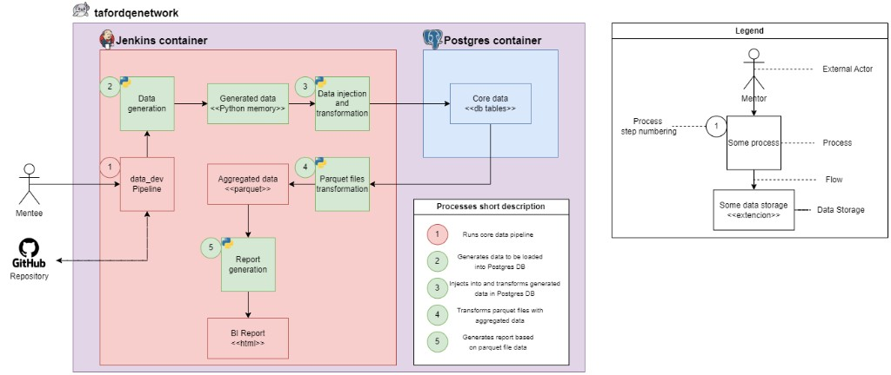
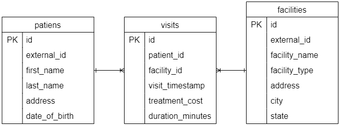
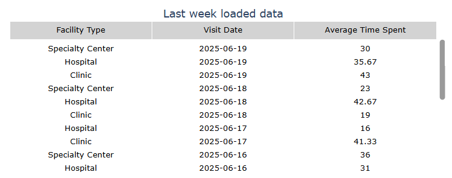
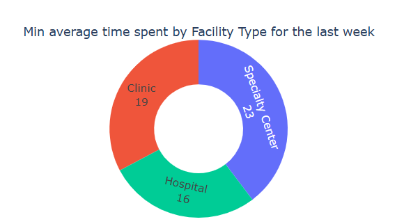
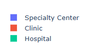

# Project Environment

In this course, you will actively work on a project that was developed specifically for this training.

## Project structure

The training project is **tafordqenetwork**: a data pipeline from generation through Postgres to aggregated Parquet and an HTML BI report, all within a single network boundary.

### Environment and infrastructure

Inside the **tafordqenetwork** network:

| Area | Role |
| --- | --- |
| **Jenkins container** | Hosts the pipeline steps (data generation, load/transform, Parquet aggregation, report). |
| **Postgres container** | Holds **core data** (`<<db tables>>`). |

### External actors

| Actor | Role |
| --- | --- |
| **Mentee** | Starts and works with the pipeline. |
| **GitHub repository** | Source/destination used by the initial pipeline step. |

### Data pipeline (numbered steps)

Most steps are implemented in **Python** (Python logo on the diagram).

| Step | Name | Short description |
| --- | --- | --- |
| 1 | **data_dev pipeline** | Runs the core data pipeline; entry point for the mentee; interacts with GitHub. |
| 2 | **Data generation** | Generates data to be loaded into the Postgres DB (`<<Python memory>>`). |
| 3 | **Data injection and transformation** | Injects and transforms generated data in Postgres (`<<db tables>>`). |
| 4 | **Parquet files transformation** | Transforms Parquet files with aggregated data (`<<parquet>>`). |
| 5 | **Report generation** | Generates a report based on Parquet file data (`<<html>>` BI report). |

### Diagram legend

| Symbol | Meaning |
| --- | --- |
| Stick figure | External actor (e.g. mentor, mentee). |
| Numbered circle (1–5) | Process step. |
| Green box | Process. |
| Red box with `<<…>>` | Data storage and format. |
| Solid arrow | Flow / direction of data. |

## Pipeline processes

### 1. data_dev pipeline

#### Stage 1: Update Packages

- Updates the system's package list to ensure the latest versions are available.
- Installs a specific library (`libpq-dev`) required for PostgreSQL-related tasks.

#### Stage 2: Install Python

- Installs Python 3 and its package manager (pip).
- Installs a specific Python module for creating virtual environments.

#### Stage 3: Clone Repository

- Retrieves the code from a Git repository hosted on GitHub.
- Checks out the `main` branch of the repository.

#### Stage 4: Install Dependencies

- Creates a Python virtual environment to isolate dependencies.
- Activates the virtual environment.
- Installs all required Python packages listed in a `requirements.txt` file.

#### Stage 5: Run Main Script

- Executes the main Python script (`main.py`) from the specified folder.

### 2. Data generator

The main idea of this process is to generate realistic mock data for testing, development, or simulation purposes. It creates fake but structured data for patients, healthcare facilities, and their visits to those facilities.

### 3. Core data — Postgres DB

#### Facilities table

This table is like a list of all the healthcare places (e.g., hospitals, clinics). It stores details like the name of the place, its type (hospital or clinic), and its address.

#### Patients table

This table is like a list of all the people who visit the healthcare places. It stores details like their name, date of birth, and where they live.

#### Visits table

This table keeps track of every time a patient visits a healthcare place. It records which patient visited, which place they went to, when they went, how much the treatment cost, and how long the visit lasted.

#### Entity-relationship model

The `visits` table links patients to facilities for each visit event (one-to-many from each parent table to `visits`, via `patient_id` and `facility_id`).

**Table: `patiens`** (spelling as on the diagram)

| Column | Key |
| --- | --- |
| `id` | PK |
| `external_id` | |
| `first_name` | |
| `last_name` | |
| `address` | |
| `date_of_birth` | |

**Table: `visits`**

| Column | Key |
| --- | --- |
| `id` | PK |
| `patient_id` | FK → `patiens` |
| `facility_id` | FK → `facilities` |
| `visit_timestamp` | |
| `treatment_cost` | |
| `duration_minutes` | |

**Table: `facilities`**

| Column | Key |
| --- | --- |
| `id` | PK |
| `external_id` | |
| `facility_name` | |
| `facility_type` | |
| `address` | |
| `city` | |
| `state` | |

### 4. Parquet files with aggregated data

Parquet files are created based on Postgres DB data. See [parquet-aggregated-data-mapping.md](parquet-aggregated-data-mapping.md) for dataset definitions, column mappings, filters, and partitioning.

### 5. HTML Report

This report provides data for the last week from the files: [`facility_type_avg_time_spent_per_visit_date`](parquet-aggregated-data-mapping.md#facility_type_avg_time_spent_per_visit_date).

#### Table

Provides the data for the last week (7 days).

#### Doughnut

Provides minimal average time spent for the last week (7 days) per facility type.

#### Filtering

## Main aspects

- The data is generated for visits from **2000-01-01** to the current launch date.
- The data in the database is merged with new data (new visits to current date are generated) if you run the pipeline in subsequent days.
- The data in the parquet files and report will also be updated.

